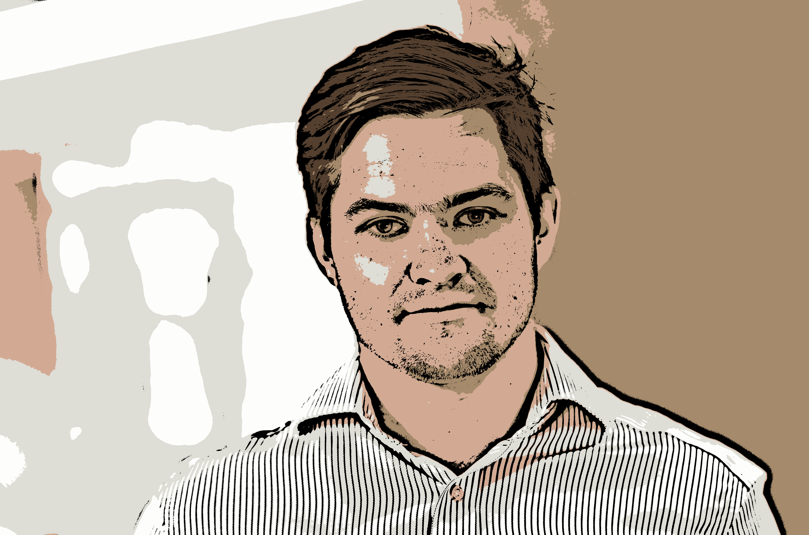

# Profile Picture 

Simple script to apply transformations to a headshot for use as a profile picture in online services. 

### Dependencies
- python-opencv

## Original Image 

## Edges Only 

## Cartoon Image

